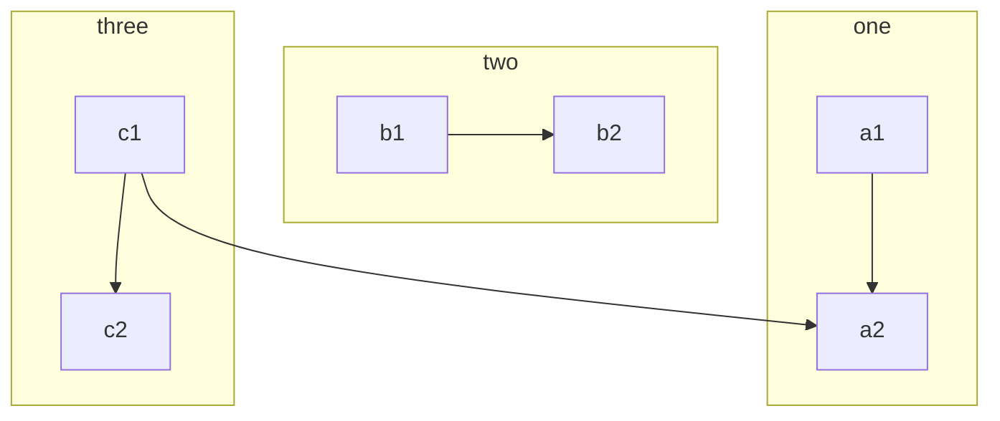

# Test

## Welcome to GitHub Pages Test page
<hr>
<br>
[1st - Welcome](#welcome-to-github-pages)<br>
[2nd - Code](#code)<br>
[3rd - Example](#example)<br>
[4th - Lorem Ipsum](#lorem-ipsum)<br>

### This is a test repository to test Github Pages
<!--- -->
<br>

[Content Page](content/)

[Markdown_Language](content/markDownLang/)

[AboutME](about/AboutME/)

[About](about/about.md)
<br>
For githubpages theme:
[Rundocs IO Theme](https://rundocs.io/)
<br>
## <strong>Code:</strong>
> Code block:<br>


```
#include <stdio.h>

int main()
{
    printf("Hello World");
    return 0;
}
```

Another Code Block Style (jekyll inline_highlight plugin)

<!-- -->


int main()
{
    printf("Hello World");
    return 0;
}




```note
### This is a note

Markdown is supported, Text can be **bold**, _italic_, or ~~strikethrough~~. [Links](https://github.com) should be blue with no underlines

`inline code`

[`inline code inside link`](#)
```




<br>

## collapsible markdown?

<details><summary>CLICK ME</summary>
<p>

#### yes, even hidden code blocks!
<br>
```
print("hello world!")
```
<br>

</p>
</details>

## Example 
<br>
[RayTracing Example](content/prj/raytr/index.html)
<br><br>
<u>How to create Js RayTracing tutorial:</u> <br>
[literate-raytracer](https://tmcw.github.io/literate-raytracer/)

<br>
<br>
For lorem ipsum generator: <br>
https://www.lipsum.com/
<br>
<br>
<br>


# Lorem Ipsum
"Neque porro quisquam est qui dolorem ipsum quia dolor sit amet, consectetur, adipisci velit..."
"There is no one who loves pain itself, who seeks after it and wants to have it, simply because it is pain..."

Lorem ipsum dolor sit amet, consectetur adipiscing elit. Sed convallis rutrum mauris non vehicula. Cras diam libero, consectetur nec accumsan at, condimentum at tortor. Duis sollicitudin finibus placerat. Suspendisse sed arcu nulla. Donec aliquet feugiat euismod. Donec quis eleifend tellus. Curabitur interdum ex lobortis orci varius, aliquam sodales ipsum rutrum. Interdum et malesuada fames ac ante ipsum primis in faucibus. Aliquam eget augue posuere, interdum purus et, dictum augue. Mauris interdum laoreet leo, ut viverra mi dictum nec. Phasellus fringilla condimentum ligula, eu fringilla urna rutrum in. Morbi non neque non dui lacinia ullamcorper. Morbi quis magna vel dolor rhoncus dictum varius at mauris.

Aliquam feugiat neque in pharetra consectetur. Phasellus luctus, magna pharetra euismod rutrum, turpis orci iaculis nisi, eget pellentesque ex leo ut felis. Vivamus lacinia consequat leo, et cursus urna lacinia quis. Vivamus laoreet magna eu nisl blandit, sit amet convallis neque accumsan. Duis venenatis sollicitudin turpis in condimentum. Vestibulum venenatis mi enim, eu vehicula diam laoreet vitae. Proin hendrerit, orci et fringilla maximus, neque justo porttitor sapien, vitae tristique elit sem sit amet felis. Vestibulum vestibulum dui id tristique tempus. Donec venenatis, odio id euismod tincidunt, nisl nulla ornare sem, facilisis efficitur quam nibh vitae turpis. Quisque tortor tortor, ultrices non placerat vitae, tempor sit amet augue.

Aliquam in magna eu nisi finibus rutrum a et nisi. Vestibulum ante ipsum primis in faucibus orci luctus et ultrices posuere cubilia curae; Nulla in sem a turpis molestie pretium a sit amet dui. Praesent aliquam venenatis metus at cursus. Pellentesque habitant morbi tristique senectus et netus et malesuada fames ac turpis egestas. In tempor sem quis consectetur facilisis. Nullam vitae elementum turpis. Duis ultrices nisi vestibulum facilisis mollis.

Nam ante orci, commodo ut vehicula a, dignissim in erat. Nunc ultrices vitae urna vel cursus. Donec eget imperdiet ipsum. In non tellus semper erat facilisis consectetur. Pellentesque tempor imperdiet enim nec tempor. Nullam sodales tempus sem, et elementum dui consectetur eget. Proin lobortis turpis libero. Curabitur sodales, ligula eu faucibus pretium, dui neque efficitur quam, in suscipit arcu tortor in turpis. Etiam suscipit magna a ex tincidunt, id aliquet erat aliquet. Pellentesque pharetra, augue at aliquet scelerisque, metus velit facilisis lectus, sed volutpat magna sapien sit amet nibh. Aliquam erat volutpat. Fusce finibus laoreet elementum. Nulla at augue nisi. Integer gravida vel ante nec feugiat. Proin quis mi maximus, dapibus neque eu, suscipit ligula.

Etiam nec volutpat mi. Etiam ipsum ante, convallis id lectus at, cursus rutrum neque. Mauris a porttitor sem, nec rhoncus magna. Donec porta luctus rhoncus. Nulla ultricies porta odio, a faucibus nulla rutrum eget. Maecenas venenatis sed lectus non dictum. Curabitur finibus erat sit amet ex convallis, a laoreet diam elementum. Cras mollis nunc nec quam pretium, a auctor lorem blandit.
Generated 5 paragraphs, 456 words, 3083 bytes of Lorem Ipsum
